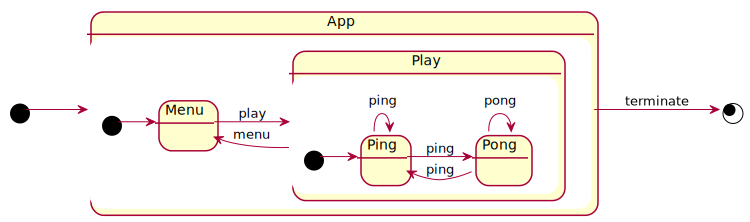

# The asynchronous hierarchical state machine (HSM)

## Concept
"Let the compiler do the optimization"

"Each state is an async function"

"State-Transitions are sequences of async functions"

"States of the same composite share state using an instance of 'Composite<Data>'"

"Composites may be nested, forming an Hierarchical State Machine (HSM)"

"Within a composite its states may be cyclic."

"Async-await functions are managed within the context of the composite."

"Exiting an async function will drop all its resources, incl other async-awaits."

"Transiting to a new state is performed by a sequence of async-await functions"

"The total code size is a few lines of code"

"Parallel states are formed by multiple composites, bound by an async-await compsition."
 
## Features
* Hierarchical State Compositions
* Parallel States
* Joining States
* Asynchronous State Handler
* Performant

## License

This work is dual-licensed under Apache 2.0 and GPL 2.0 (or any later version).
You can choose between one of them if you use this work.

 SPDX-License-Identifier: Apache-2.0 OR MIT
## Integration

Put this in your Cargo.toml:
```toml
## Cargo.toml file
[dependencies]
async-hsm = "^0.1"
```

## Example
The following state diagram (PlantUml syntax) can be encoded by the following Rust-code 



See here the [ping pong state diagram](https://raw.githubusercontent.com/frehberg/async-hsm/main/res/hierarchy.svg)

```edition2018
    use async_std::prelude::*;
    use async_std::stream;
    use async_std::task;
    use async_hsm::{Composite, Transit, Builder, BuilderPair};
    use std::rc::Rc;
    use std::cell::RefCell;

    type Score = u32;
    type EnterStateScore = u32;
    type AppComposite = Composite<AppData>;
    type PlayComposite = Composite<AppData>;


    type AppTransit<'s> = Transit<'s, AppComposite, Score, AppError>;
    type PlayTransit<'s> = Transit<'s, PlayComposite, BuilderPair<AppComposite, EnterStateScore, Score, AppError>, AppError>;

    type AppBuilder = Builder<AppComposite, EnterStateScore, Score, AppError>;
    type AppBuilderPair = BuilderPair<AppComposite, EnterStateScore, Score, AppError>;

    #[derive(Debug, Clone, PartialEq)]
    enum AppError { Failure }

    static TO_MENU: AppBuilder = || |comp, score| Box::pin(menu(comp, score));
    static TO_PLAY: AppBuilder = || |comp, score| Box::pin(play(comp, score));
    static TERMINATE: AppBuilder = || |comp, score| Box::pin(terminate(comp, score));

    #[derive(Debug, Clone, PartialEq)]
    enum IoEvent { Ping, Pong, Terminate, Menu, Play }

    #[derive(Debug, Clone)]
    struct AppData {
        event: Rc<RefCell<stream::FromIter<std::vec::IntoIter<IoEvent>>>>,
    }

    async fn pong<'s>(comp: &'s mut PlayComposite, score: Score) -> Result<PlayTransit<'s>, AppError> {
        let mut score = score + 1;
        let event = comp.data.event.clone();
        while let Some(event) = (*event).borrow_mut().next().await {
            match event {
                IoEvent::Ping => return Ok(Transit::To(Box::pin(ping(comp, score)))),
                IoEvent::Terminate => return Ok(Transit::Lift((TERMINATE, score))),
                _ => score += 1,
            }
        }
        Ok(Transit::Lift((TERMINATE, score)))
    }

    async fn ping<'s>(comp: &'s mut PlayComposite, score: Score) -> Result<PlayTransit<'s>, AppError> {
        let mut score = score + 1;
        let event = comp.data.event.clone();
        while let Some(event) = (*event).borrow_mut().next().await {
            match event {
                IoEvent::Pong => return Ok(Transit::To(Box::pin(pong(comp, score)))),
                IoEvent::Terminate => return Ok(Transit::Lift((TERMINATE, score))),
                _ => score += 1,
            }
        }
        Ok(Transit::Lift((TERMINATE, score)))
    }

    async fn terminate<'s>(_comp: &'s mut AppComposite, score: Score) -> Result<AppTransit<'s>, AppError> {
        Ok(Transit::Lift(score))
    }

    async fn play<'s>(comp: &'s mut AppComposite, score: Score) -> Result<AppTransit<'s>, AppError> {
        let event = comp.data.event.clone();
        let mut play = PlayComposite::new(AppData { event: event });
        let (builder, build_arg): AppBuilderPair = play.init(ping, score).await?;
        builder()(comp, build_arg).await
    }

    async fn menu<'s>(comp: &'s mut AppComposite, score: Score) -> Result<AppTransit<'s>, AppError> {
        let score = score;
        let event = comp.data.event.clone();
        while let Some(event) = (*event).borrow_mut().next().await {
            match event {
                IoEvent::Play => return Ok(Transit::To(Box::pin(play(comp, score)))),
                IoEvent::Terminate => return Ok(Transit::Lift(score)),
                _ => continue,
            }
        }
        Ok(Transit::Lift(score))
    }

    #[test]
    fn test_game() {
        let sequence = vec![IoEvent::Play, IoEvent::Ping, IoEvent::Pong,
                            IoEvent::Ping, IoEvent::Pong, IoEvent::Terminate];
        let event = Rc::new(RefCell::new(stream::from_iter(sequence)));
        let start_score = 0;
        let mut app = AppComposite::new(AppData { event: event });
        let result: Result<Score, AppError> = task::block_on(app.init(menu, start_score));
        assert_eq!(Ok(5), result);
    }
```